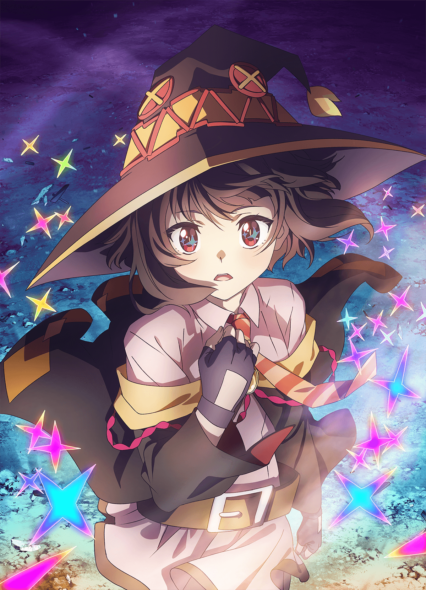

## Hi, I'm Nolan.Ho

**LLM infrastructure engineer & researcher — making millions of LLMs train and serve reliably.**

## 🧭 About Me

- 🔬 Research Scientist & Infra Lead @ [Mind Lab](https://macaron.im/mindlab) — building managed infrastructure for training and serving millions of LLMs. My work spans distributed RL training systems, large-scale LoRA training, CUDA kernel optimization, KV cache storage, and self-evolving agent infrastructure
- 🎓 Cryptography grad from [HUST](https://hust.edu.cn) (华中科技大学) · Co-founded NoEdgeAI / Doc2X (backed by MiraclePlus)
- 💼 Ex-[DeepSeek](https://deepseek.com) SRE · Ex-[ByteDance / Volcengine](https://www.volcengine.com/) Storage Engineer
- 💻 **Rust** · **Go** · **TypeScript** · **Python** · **CUDA** — distributed systems, LLM training/inference, KV cache, RL infrastructure
- 🌐 From engineering to research — making complex systems run reliably, discovering new problems along the way
- 🎮 Also: anime, investments, systems theory, cognitive science

## 🔥 Spirit

  

Megumin devoted her entire life to a single spell — explosion, and nothing else.

<table><tr><td>

*何か成す者とは歩み続ける愚者である、成せぬ者とは歩めを止めた賢者である*

*"成一事者，矢志不渝之愚者；毁一事者，停滞不前之贤者"*

—— ロクでなし魔術講師と禁忌教典

</td></tr></table>

## 📈 GitHub Activity

  

  
  

    
🐍 Snake animation

    
  

